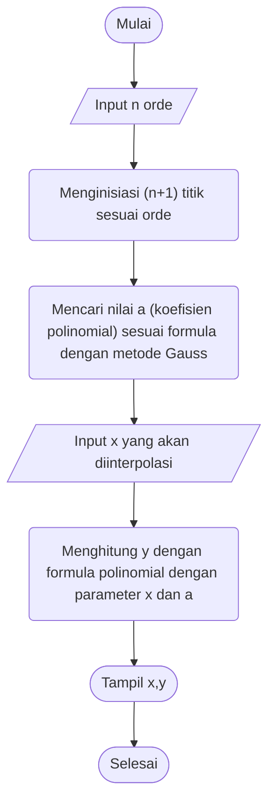
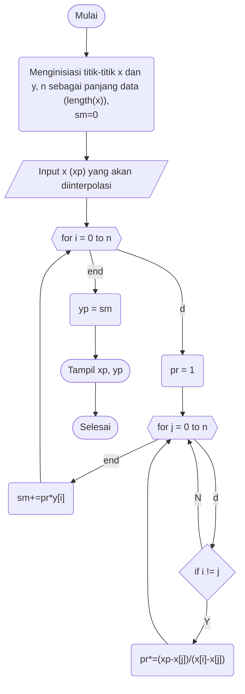

# KN-M5

## Interpolasi Polinomial

```mermaid
graph TD;
    A([Mulai])-->B[/Input n orde/];
    B-->C("Menginisiasi (n+1) titik sesuai orde");
    C-->D("Mencari nilai a (koefisien polinomial) sesuai formula dengan metode Gauss");
    D-->E[/Input x yang akan diinterpolasi/];
    E-->F(Menghitung y dengan formula polinomial dengan parameter x dan a);
    F-->G([Tampil x,y]);
    G-->H([Selesai]);
```

## Interpolasi Lagrange

```mermaid
graph TD;
    A([Mulai])-->B("Menginisiasi titik-titik x dan y, n sebagai panjang data (length(x)),<br>sm=0");
    B-->C[/"Input x (xp) yang akan diinterpolasi"/];
    C-->D{{for i = 0 to n}};
    D--do-->E(pr = 1);
    E-->F{{for j = 0 to n}};
    F--do-->G{if i != j};
    G--N-->F;
    G--Y-->H("pr*=(xp-x[j])/(x[i]-x[j])");
    H-->F;
    F--end-->I("sm+=pr*y[i]");
    I-->D;
    D--end-->J(yp = sm);
    J-->K([Tampil xp, yp]);
    K-->L([Selesai]);
```
